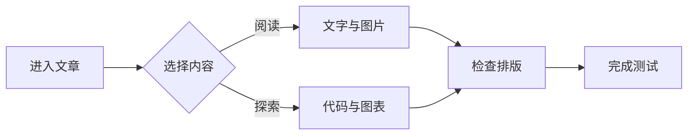
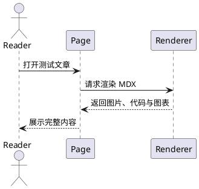

import {
	Badge,
	StepItem,
	Steps,
	TabGroup,
	Timeline,
	TimelineItem,
} from "@/components/firefly-mdx";

这不是一篇只供机器读取的样例清单，而是一间临时搭起的展厅：文字、图片、公式、图表和交互组件都被放进同一条阅读路径里。它的任务很简单——确认一篇文章从列表卡片进入正文以后，每一种常用表达都能自然出现、清楚阅读，并在明暗主题和不同屏幕宽度下保持稳定。

> [!NOTE] 测试说明
> 本文覆盖的是当前站点已经接入的主要文章能力。每一类功能至少出现一次，但不会穷举 Mermaid、PlantUML 或代码高亮器支持的所有语言和图形。

## 快速目录

- [基础排版](#基础排版)
- [图片与图注](#图片与图注)
- [提醒框、剧透与折叠内容](#提醒框剧透与折叠内容)
- [代码展示](#代码展示)
- [公式与图表](#公式与图表)
- [Firefly 专属 MDX 组件](#firefly-专属-mdx-组件)
- [链接、卡片与嵌入内容](#链接卡片与嵌入内容)
- [最终检查表](#最终检查表)

---

## 基础排版

一篇文章首先应该经得起最普通的阅读。这里同时出现**粗体**、*斜体*、***粗斜体***、~~删除线~~、`行内代码`、<mark>高亮文本</mark>，以及一个带解释的缩写：<abbr title="Markdown Data Experience">MDX</abbr>。

键盘提示也可以直接写进正文：按 <kbd>Ctrl</kbd> + <kbd>K</kbd>，通常意味着“开始搜索”。水的化学式可以写成 H<sub>2</sub>O，面积单位也可以写成 m<sup>2</sup>。

### 列表与任务

下面的无序列表包含嵌套层级：

- 内容层
  - 标题与段落
  - 图片与图注
- 表达层
  - 代码、公式与图表
  - 提醒框和交互组件
- 导航层
  - 内部链接
  - 外部链接

有序列表则适合表达确定的阅读顺序：

1. 先从文章列表打开本文。
2. 再滚动检查各类长内容。
3. 最后切换主题并缩窄窗口。

任务列表可以留下清晰的状态：

- [x] 文章被内容集合识别
- [x] 封面和正文图片使用本地资源
- [ ] 在真实浏览器中完成最后的人工观感确认

### 引用与分隔

> 页面不是内容的容器外壳，而是内容在具体屏幕上发生的方式。
>
> - 文字需要节奏；
> - 图片需要呼吸；
> - 交互需要明确的反馈。

上面的引用结束后，用一条分隔线切换语气。

---

### 表格

| 功能 | 本文示例 | 期望结果 |
| :--- | :---: | ---: |
| 文本排版 | 强调、删除、高亮 | 行内样式清晰 |
| 图片 | 单图、图注、网格 | 自适应且可查看原图 |
| 代码 | 标题、行号、标记、分组 | 可读且可复制 |
| 图表 | Mermaid、PlantUML | 正确渲染并支持交互 |

### 脚注

Firefly 基于 Astro 构建[^astro]，而 MDX 让 Markdown 可以使用组件[^mdx]。脚注本身应出现在文章末尾，并可通过回链返回正文。

[^astro]: Astro 是一个面向内容型网站的 Web 框架。
[^mdx]: MDX 将 Markdown 文本与组件表达结合在同一份文档中。

## 图片与图注

先放一张普通正文大图。图片的替代文本会同时承担无障碍描述和图注测试：


接下来使用图片网格。三张图片比例不同，适合检查响应式列数、统一高度裁切、图注基线和灯箱查看：

[grid]


[/grid]

> [!TIP] 图片检查要点
> 在窄屏下，网格应回到单列；在宽屏下，它应形成整齐的多列画廊。点击被裁切的图片时，应能查看完整构图。

## 提醒框、剧透与折叠内容

GitHub 风格提醒框适合把不同优先级的信息从正文中分离出来。

> [!IMPORTANT] 重要信息
> 测试文章的价值不在于“出现了多少组件”，而在于这些组件能否与正常阅读共存。

> [!WARNING] 兼容性提醒
> 图表与视频依赖脚本或外部服务；若内容本身出现而交互没有启动，应继续检查客户端初始化过程。

> [!CAUTION] 破坏性操作
> 不要为了测试文章而覆盖现有素材，也不要把临时生成目录写进文章路径。

行内剧透可以隐藏答案：这篇文章的秘密是 :spoiler[所有功能最后都要回到**可读性**]。

<details>
	<summary>展开一段补充说明</summary>

	折叠区域适合放次要解释、推导过程或较长的补充材料。这里还包含一个小列表：

	- 默认收起，减少视觉负担；
	- 点击标题后展开；
	- 再次点击即可恢复。
</details>

## 代码展示

行内配置可以写成 `draft: false`。较长内容则交给 Expressive Code。

### 标题、行号与行标记

```ts title="feature-check.ts" showLineNumbers {3} ins={5-7}
type FeatureState = "pending" | "passed" | "failed";

const checks: Record<string, FeatureState> = {};

export function markPassed(feature: string) {
	checks[feature] = "passed";
	return checks;
}
```

### 差异视图

```diff
-const articleCount = 0;
+const articleCount = 1;
```

### 多语言代码组

::: code-group labels=[TypeScript, Python]

```ts
const message = "文字、图片与图表已就位";
console.log(message);
```

```py
message = "文字、图片与图表已就位"
print(message)
```

:::

### 可折叠长代码

下面的首尾部分会折叠，用于检查长代码块、起始行号和折叠按钮。

```ts title="article-audit.ts" showLineNumbers startLineNumber=10 collapse={10-14,25-29}
type AuditResult = {
	name: string;
	ok: boolean;
	note: string;
};

const results: AuditResult[] = [];

function audit(name: string, ok: boolean, note = "") {
	results.push({ name, ok, note });
}

audit("frontmatter", true);
audit("images", true);
audit("callouts", true);
audit("code", true);
audit("math", true);
audit("diagrams", true);
audit("mdx-components", true);

const passed = results.filter((item) => item.ok).length;
const total = results.length;

console.log("通过 " + passed + "/" + total + " 项检查");
console.table(results);
```

## 公式与图表

行内公式适合留在句子中，例如欧拉恒等式 $e^{i\pi}+1=0$。块级公式则适合展示完整关系：

$$
\operatorname{score}
=
\frac{\text{可读性}\times\text{稳定性}}{\text{不必要的复杂度}+1}
$$

矩阵与分段表达也应保持清晰：

$$
A=
\begin{pmatrix}
1 & 2 \\
3 & 4
\end{pmatrix},
\qquad
f(x)=
\begin{cases}
x^2, & x\ge 0 \\
-x, & x<0
\end{cases}
$$

化学扩展使用 mhchem 语法：

$$
\ce{6CO2 + 6H2O -> C6H12O6 + 6O2}
$$

### Mermaid 流程图



### PlantUML 时序图



## Firefly 专属 MDX 组件

组件可以像普通段落一样参与叙述。下面先测试所有徽章色型：

<Badge>默认</Badge> <Badge type="tip">提示</Badge> <Badge type="note">笔记</Badge> <Badge type="important">重要</Badge> <Badge type="warning">警告</Badge> <Badge type="caution">谨慎</Badge>

### 步骤条

<Steps>
	<StepItem title="准备内容" icon="edit">
		写下可阅读的正文，并确认标题层级没有跳跃。
	</StepItem>
	<StepItem title="加入丰富元素" type="tip" icon="star">
		依次加入图片、代码、公式、图表和交互组件。
	</StepItem>
	<StepItem title="完成验证" type="important" icon="flag">
		检查文章列表、正文页面、主题切换与窄屏布局。
	</StepItem>
</Steps>

### 时间线

<Timeline>
	<TimelineItem date="第一阶段" title="普通文本" type="note" icon="book">
		先确认最基础的段落、列表、引用和表格可以顺畅阅读。
	</TimelineItem>
	<TimelineItem date="第二阶段" title="富媒体" type="tip" icon="star">
		再让图片、公式和图表进入同一篇文章。
	</TimelineItem>
	<TimelineItem date="第三阶段" title="交互检查" type="important" icon="rocket">
		最后验证标签页、折叠区域、灯箱和图表缩放。
	</TimelineItem>
</Timeline>

### 交互标签页

<TabGroup labels={["阅读版", "检查版"]} client:load>
	<div>
		**阅读版**关注段落节奏、图文关系与信息层级。
	</div>
	<div>
		**检查版**关注溢出、主题颜色、键盘操作与交互状态。
	</div>
</TabGroup>

## 链接、卡片与嵌入内容

普通外链用于检查新窗口与外链图标：[Astro 官方网站](https://astro.build/)。

邮箱地址用于检查页面中的地址保护：feature-test@example.com。

Wiki Link 可以跳转到本文的指定标题：[[#公式与图表|查看公式与图表]]。单独成段时，它会成为文章卡片：

[[firefly-full-feature-test|Firefly 全功能测试文章]]

GitHub 仓库指令会渲染为项目卡片：

::github{repo="CuteLeaf/Firefly"}

### 视频嵌入

下面的播放器用于检查响应式 iframe、圆角裁切和外部媒体加载。外部服务不可用时，页面其余内容仍应正常阅读。

<iframe
	width="100%"
	height="420"
	src="https://www.youtube-nocookie.com/embed/5gIf0_xpFPI"
	title="文章视频嵌入功能测试"
	loading="lazy"
	referrerPolicy="strict-origin-when-cross-origin"
	allow="accelerometer; autoplay; clipboard-write; encrypted-media; gyroscope; picture-in-picture; web-share"
	allowFullScreen
></iframe>

## 最终检查表

| 检查面 | 操作 | 通过标准 |
| --- | --- | --- |
| 文章入口 | 从首页近期文章或文章列表进入 | 标题、摘要和封面正确 |
| 图片 | 查看单图并点击网格图片 | 比例稳定，灯箱可用 |
| 主题 | 在明暗主题间切换 | 文字、代码、图表均清晰 |
| 交互 | 操作折叠、标签页和代码按钮 | 状态切换正常 |
| 响应式 | 缩窄浏览器窗口 | 表格、图表和媒体不撑破正文 |
| 导航 | 点击目录、Wiki Link 和脚注回链 | 锚点与返回路径正确 |

> [!NOTE] 终点也是起点
> 如果这张检查表全部通过，说明文章系统的主要能力已经能够协同工作；如果某一项失败，本文也提供了足够明确的复现位置。

至此，展厅里的灯已经全部打开。接下来要做的，不是再加入一种花哨语法，而是逐项确认这些内容在真实页面里是否仍然安静、稳定、可读。
