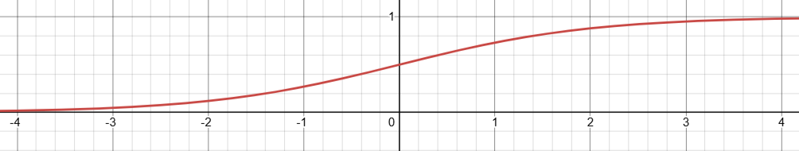

## 1 Logistic回归

### 1.1 什么是 Logistic 回归

**定义**：Logistic 回归是用于二分类问题的监督学习算法。

所谓二分类，就是标签只有两种 $y\in\{0,1\}$。

> **假设**判断一张图片是不是猫 $y=\begin{cases}1,& \text{是猫}\\0,& \text{不是猫}\end{cases}$ ，输入是一张图片 $x$，模型输出预测 $\hat y$，但是 Logistic 回归并不是简单地输出 0 或 1，而是输出 ${\hat y=P(y=1\mid x)}$。

给定输入 $x=\begin{bmatrix}x_1\\x_2\\\vdots\\x_{n_x}\end{bmatrix}$，Logistic 回归希望模型认为 $y=1$ 的**概率**是多少，满足 ${0\leq\hat y\leq1}$。

### 1.2 什么是输入 $x$

**定义**：$x$ 是一个包含所有输入特征的向量，$x\in\mathbb R^{n_x}$，$n_x$ 表示**特征数量**。

> **假设** RGB 图片尺寸为 $64\times64$，每个像素有 R、G、B 三个数，那么总特征数量 $n_x=64\times64\times3=12288$，$x\in\mathbb R^{12288}$。

一张图片最终也可以表示为一个**很长的数字向量**，数字向量的总和即为特征数量。

### 1.3 什么是参数 $w$ 和 $b$

**定义**：Logistic 回归需要学习两个参数**权重** $w$ 和**偏置** $b$，其中 $w\in\mathbb R^{n_x}$，$b\in\mathbb R$，即 $w=\begin{bmatrix}w_1\\w_2\\\vdots\\w_{n_x}\end{bmatrix}$，$b$ 只是一个实数。

**目的**：模型训练的核心目的之一就是找到合适的 $w$ 和 $b$。

**定义** **$w$**：权重 $w$ 决定不同输入特征对预测结果产生多大的影响。

模型首先计算 $\boxed{z=w^Tx+b}$

展开：$z=w_1x_1+w_2x_2+\cdots+w_{n_x}x_{n_x}+b$

> **假设**只有两个特征 $x=\begin{bmatrix}x_1\\x_2\end{bmatrix}$，模型参数为 $w=\begin{bmatrix}2\\-3\end{bmatrix}$，那么 $z=2x_1-3x_2+b$。
>
> 这里 $x_1$ 前面的权重是 $2$，说明随着 $x_1$ 增大，$z$ 倾向于变大。
>
> 而 $x_2$ 前面的权重是 $-3$，说明随着 $x_2$ 增大，$z$ 倾向于变小。
>
> 因此可以简单理解为 $w_i>0$ 代表这个特征增大会让模型更倾向于 $y=1$，而 $w_i<0$则会让模型更倾向于 $y=0$。

至于某个 $w_i$ 到底应该是正是负，则是通过后续训练学习出来的。

**定义** **$b$**：$b$ 是一个额外的常数参数，用来整体调整模型的输出。

可以理解成在不改变各个特征权重的情况下，对整个模型进行整体平移。

### 1.4 为什么不能直接令 $\hat y=w^Tx+b$

**原因**：概率必须满足 ${0\leq P\leq1}$，但 $w^Tx+b$ 的输出范围可以是任何实数。

我们需要增加一个函数，把任意实数转换到 $0\sim1$ 之间，这个函数就是 **sigmoid**。

### 1.5 什么是sigmoid函数

**定义**：${\sigma(z)=\frac{1}{1+e^{-z}}}$

Logistic 回归先计算 $z=w^Tx+b$，再把 $z$ 输入 sigmoid：$\hat y=\sigma(z)$，因此最终得到：${\hat y=\sigma(w^Tx+b)}$。

$z$ 可以是任何实数，但经过 sigmoid 后，$\hat y$ 一定在 0 和 1 之间。

**函数** **${\sigma(z)=\frac{1}{1+e^{-z}}}$** **图像**：

1. **当** **$z=0$** **时**：

$\hat y=\sigma(0)=\frac1{1+e^0}$ $=0.5$

意味着 $z=0$ 对应模型认为 $y=1$ 和 $y=0$ 各有约一半可能性。

2. **当** **$z$** **很大时**：

$\hat y=\sigma(z)=\frac1{1+e^{-z}}\rightarrow\frac1{1+0}=1$

意味着 $z$ 很大对应模型认为 $y=1$ 的可能性很大。

3. **当** **$z$** **是很大的负数时**：

$\hat y=\sigma(z)=\frac1{1+e^{-z}}\rightarrow0$

意味着 $z$ 是很大的负数对应模型认为 $y=0$ 的可能性很大。

### 1.6 什么是决策边界

**定义**：决策边界是模型恰好处于两个类别分界的位置。

如果采用 0.5 作为分类阈值，边界就是 ${w^Tx+b=0}$。

> **假设**只有两个输入特征 $x_1,x_2$，那么 $w_1x_1+w_2x_2+b=0$ 可以整理成 $x_2=-\frac{w_1}{w_2}x_1-\frac{b}{w_2}$，这实际上就是一条直线。

直线一侧预测成 1，另一侧预测成 0。

因此虽然 Logistic 回归使用了非线性的 sigmoid 函数，但它的基本决策边界仍然是**线性的。**
