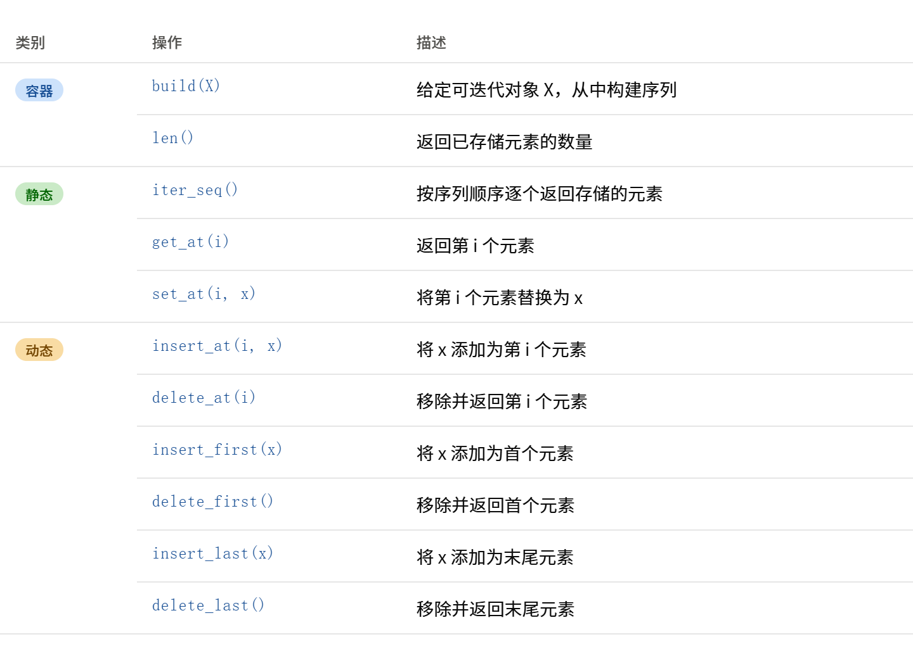
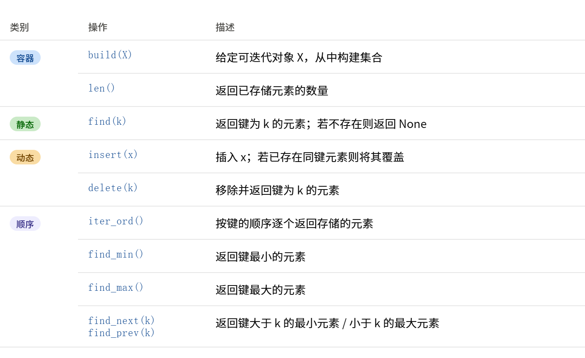
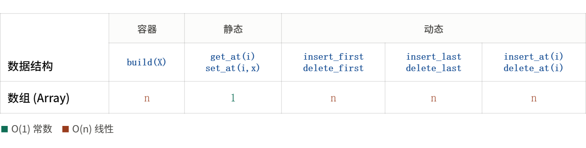
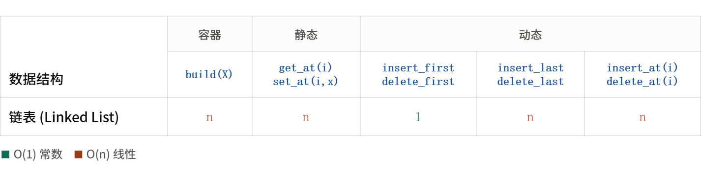
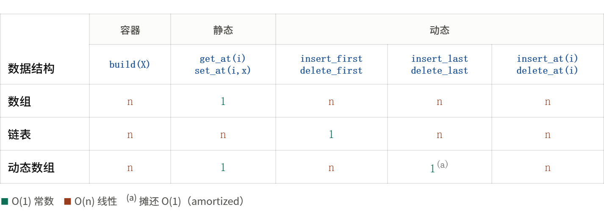

## Lec02 数据结构

### 1. 接口

**数据结构（Data Structure）**  是一种存储数据的方式，并附带有支持对数据进行操作的算法。

所支持操作的集合被称为**接口 (Interface / API / ADT)** 。

接口是一种**规范 (specification)** ：支持哪些操作（即**问题**！）。

接口描述需要这个数据结构提供什么功能。

指的是**一个数据结构对外暴露的操作集合，** 它只规定：可以存什么数据、可以执行什么操作、操作是什么意思，但不规定内部如何实现。

如**栈（stack）** 这个抽象数据类型的接口约定：

```cpp
class Stack {
public:
    void push(int x);   // 压入栈顶
    int  pop();         // 弹出并返回栈顶
    int  top();         // 查看栈顶，不弹出
    bool empty();       // 是否为空
    int  size();        // 元素个数
};
```

栈可以用数组实现，也可以用链表实现，接口不变。

### 2. 数据结构

数据结构是一种**表示 (representation)** ：如何支持这些操作（即**解决方案**！）。

例如同样支持`get()`​、`set()`，可以使用数组、链表、数、哈希表等，不同实现方式，数据结构的选择直接决定算法效率。

比如查一个元素，用无序数组是 `O(n)`​，用哈希表是 `O(1)`​，用平衡二叉搜索树是 `O(log n)`。

### 3. 两个抽象接口

#### 序列接口

序列接口（Sequence Interface）指的是**线性序列这类数据结构对外暴露的操作集合**，序列是"元素按**顺序**排成一列、每个元素有确定的前后**位置**"的抽象数据类型。

例如`a = [5,2,9,7]`​，其中`a[0]=5  a[1]=2  a[2]=9  a[3]=7`。

序列关心“第几个元素是什么”以及“元素之间的位置关系”。

序列接口通常支持以下几类**操作**：



三层是层层递进的。**容器**是最基础的（构建 + 查规模），**静态**加上按位置读写（结构不变），**动态**再加上任意位置的增删（结构改变，并单独优化首尾两端）

特例接口：

- **栈 (stack)** ：支持 `insert_last(x)`​ 和 `delete_last()`
- **队列 (queue)** ：支持 `insert_last(x)`​ 和 `delete_first()`

‍

#### 集合接口

集合接口(Set Interface)指的是**集合这类数据结构对外暴露的操作集合，** 与序列的区别在于：序列关心元素的**顺序和位置**，集合关心元素的**内容和身份，基于值/键**来标识和查找元素，元素之间没有固定的位置关系。

集合接口通常支持以下几类**操作**：



**顺序（Order）**  是集合特有的第四层。基础集合只要求能按键查找，不要求键之间可比较，但如果键是有序的，就能额外支持"最小、最大、前驱、后继、按序遍历"等操作。

特例接口：

- **字典 (dictionary)** ：不支持上述“顺序 (Order)”操作的集合。

### 4. 静态序列

#### 数组序列 

数组序列（Array Sequence）就是**用数组来实现的序列，** 它是序列这个抽象接口的一种具体做法，把元素按顺序存在一块连续的数组空间里。

因为底层是数组（连续、地址可算），它的强项和弱项非常鲜明：

**读写某个位置极快**，时间复杂度均为 $\Theta(1)$。

依据是地址计算，元素在内存中连续存放，第 $i$ 个元素的地址等于`首地址 + i × 元素大小`，直接寻址而与 n 无关。

但是它不太擅长动态操作，**在中间插入/删除**很慢，$O(n)$。

此时插入和移除元素将需要：

- 重新分配数组内存
- 将被修改元素之后的所有元素进行平移

如果你想在第 $i$ 个位置插入一个新元素，则 $i$ 后的所有元素都需要**整体往后挪一格，** 删除同理，后面的要**整体往前补位**。最坏情况下要挪动几乎所有元素，所以是 $O(n)$。

数组序列各操作的**最坏情况复杂度：**



### 5.动态序列

#### 链表序列

链表序列（Linked List Sequence）是序列接口的另一种实现方式。

它不使用连续的存储空间，而是将每个元素单独存放在一个称为**结点（node）的单元中。**

每个节点有**两个字段：**​`node.item`​ （**保存元素本身）** 和 `node.next`​ **（保存一个指向下一个结点的指针），** 由此将所有结点依次串联，形成序列。

即包含两部分：**数据域**与**指针域**。序列另设一个**头指针（head）指向首结点**，**末结点的指针指向null**，表示序列结束。

**操作复杂度：**

1. **按位置访问为 O(n)。**  由于结点不连续，要访问第 $i$ 个元素，必须从头结点出发，沿指针逐个向后走 $i$步，故 `get_at(i)`​、`set_at(i,x)` 均为$O(n)$，这是链表相对数组的**劣势**。
2. **首部插入、删除为 O(1)。**  在已知结点位置的前提下，插入或删除只需修改若干指针，无需移动其他结点。例如首部插入，只需令新结点指向原首结点、并将头指针改指向新结点即可。故 `insert_first(x)`​、`delete_first()` 为 $O(1)$，这是链表相对数组的**优势**。



#### 动态数组序列

动态数组序列（Dynamic Array Sequence）是对静态数组的改进，目的是解决**静态数组"长度固定、无法增删元素"** 这一缺陷。

它在静态数组的基础上，**允许序列的长度随元素的增删而改变**，从而同时支持"**按下标快速读写**"与"**在尾部高效插入删除**"两类操作。

Python 的 `list` 就是一个动态数组。

关键在于**所占用的底层数组容量，大于当前实际存储的元素个数**。也就是说，分配额外的空间，这样就不必在每次执行动态操作时都重新分配内存。

- **规模（size）** ：当前实际存储的元素个数。
- **容量（capacity）** ：底层数组能容纳的元素总数，通常大于 size。

只要 size 尚未达到 capacity，尾部插入新元素时便有现成的空位可用，无需重新分配数组，直接写入即可，代价为 $O(1)$。

**动态数组扩容：**

当 size 达到 capacity 而仍需继续插入时，动态数组会执行一次扩容：申请一块容量更大的新数组，将原有元素全部复制过去，再在新空间中插入。这次扩容的代价为 $O(n)$（须复制 n 个元素）。

扩容的关键在于**倍增**策略：新容量取为原容量的常数倍（通常为 2 倍），而非仅增加固定数量的空位，保证了扩容不会频繁发生，在下一次内存重新分配之前，必须要插入 $O(n)$ 个元素。

由于重新分配内存，单次操作可能会花费 $\Theta(n)$ 的时间。但由于倍增策略使扩容极少发生，将扩容的代价均摊到其间的大量 $O(1)$ 插入上，因此，“平均”下来，每次操作花费 $\Theta(1)$ 的时间。

即**尾部插入的摊还（amortized）复杂度为** **$O(1)$**。

### 6. 摊还分析

摊还分析（Amortized Analysis）是一种将开销分摊到多次操作上的数据结构分析技术，用于评估一个操作序列的总代价，进而**求出其中每个操作的平均代价**。

可先算出整个操作序列（共 $n$ 次操作）的**总代价** $T(n)$，再除以 $n$，得到每次操作的**摊还代价** $T(n)/n$。

#### 动态数组扩容分析

**第一步：明确每次扩容复制多少元素**

采用容量倍增策略（每次扩容容量**翻倍**），从容量 1 开始。每次扩容时，须把旧数组的全部元素复制到新数组。历次扩容发生在容量即将不足时，复制的元素个数依次为：

$$
1, ; 2, ; 4, ; 8, ; \dots, ; 2^k
$$

即第一次扩容复制 1 个元素，第二次复制 2 个，第三次复制 4 个……每次扩容复制的元素数恰好是当前容量，而**容量按 2 的幂增长**。

**第二步：求出扩容的总复制代价**

把所有扩容的复制量**相加**：

$$
1 + 2 + 4 + \dots + 2^k = 2^{k+1} - 1
$$

换算成用 $n$ 表示，设最终插入了 $n$ 个元素，则容量增长到约 $2^k≈n$ 的量级（更准确地说 $2^{k}$ $<$ $n$ $≤$ $2^{k+1}$)，于是**总复制代价为**：

$$
2^{k+1} - 1 < 2 \cdot 2^k \le 2n
$$

**所有扩容的复制代价加起来小于 2n，即为** **$O(n)$**​ **。**

**第三步：计入直接写入的代价**

插入 $n$ 个元素，除了偶发的扩容复制，每个元素本身还有一次直接写入，这部分共 $n$ 次、代价 $O(n)$。

于是插入 $n$ 个元素的**总代价**为：

$$
\underbrace{n}_{\text{直接写入}} + \underbrace{(2^{k+1}-1)}_{\text{扩容复制} \, < \, 2n} \; = \; O(n)
$$

**第四步：除以操作次数，得到摊还代价**

摊还代价 = 总代价 ÷ 操作次数：

$$
\text{摊还代价} = \frac{O(n)}{n} = O(1)
$$

即**动态数组尾部插入的摊还代价为** **$O(1)$**​ **。**

### 7. 动态数组删除

从尾部删除一个元素，只需把 size 减 1（那个位置不再算作有效元素），所以单纯的尾部删除是 $O(1)$，这一点毫不费力。

**问题：**

然而，这**在空间上可能会非常浪费**，我们希望数据结构占用的空间与实际元素数成正比，即空间为 $O(n)$（n 是当前 size），**删除只减 size 不减容量的话，容量可能远大于 size**。

**尝试：**

当数组恰好满（size \= 容量）时**缩容一半（或r倍）** 。设想数组正好处于临界点，此时反复交替执行插入、删除:

- 插入：size 超过容量 → 触发扩容（$O(n)$ 复制）
- 删除：size 回到满以下 → 触发缩容（$O(n)$复制）
- 再插入：再次扩容……
- 再删除：再次缩容……

每一次操作都是 $O(n)$，这样连续 $n$ 次操作就成了 $O(n²)$，摊还代价退化为 $O(n)$！

**正确做法：**

根源在于**扩容阈值和缩容阈值相邻太近**，需要让两个阈值拉开距离，扩容线和缩容线之间**留出缓冲区**。

即**当 size 降到容量的某个较低比例时才缩容**，且缩容后让 size 只占新容量的 1/ρ（ρ \> 1，例如 ρ \= 2）。

这样一来，无论下一步是继续删除（要再删除很多个才会触发下一次缩容）还是转为扩容（要再插入很多个才会触发扩容），距离任何一次昂贵的 resize 都还有 $Ω(n)$ 次廉价操作的距离。

动态数组仅支持以 $O(1)$ 的均摊时间执行**尾部动态操作**。中间位置的插入删除仍是 $O(n)$（要移动元素），这一点扩缩容机制无法改善。


